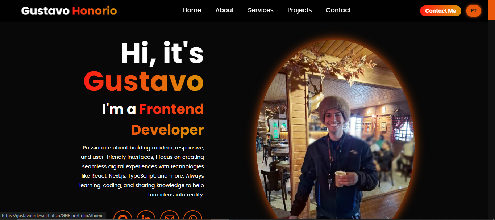

# Gustavo Honorio – Frontend Developer

### 🌐 My Portfolio / Meu Portfólio
[https://gustavohrdev.github.io/GHR.portfolio/](https://gustavohrdev.github.io/GHR.portfolio/)

[🇺🇸 English Version](#english) | [🇧🇷 Versão em Português](#português)

---

## 🇺🇸 English Version

### 👋 About Me  
Passionate Frontend Developer focusing on creating clean, user-friendly, and responsive interfaces. Skilled in **React.js**, **Next.js**, **TypeScript**, and other modern technologies. I also have experience with backend technologies like **Node.js** and **REST APIs**, enabling collaboration on full-stack projects. Always learning, coding, and sharing knowledge to help turn ideas into reality.

### 🛠️ Projects  

- **Responsive Calculator with Professional Night Theme**  
  A fully responsive calculator with dark mode and neon accents, built with HTML, CSS Grid, and JavaScript, featuring smooth animations and robust logic.  
  🔗 [Live Demo](https://gustavohrdev.github.io/Calculadora-Responsiva-/)  
  🔗 [GitHub Repository](https://github.com/GustavoHRdev/Calculadora-Responsiva-)

- **QR Code Generator**  
  A simple and stylish QR code generator with real-time API integration, fully responsive and animated interface.  
  🔗 [Live Demo](https://gustavohrdev.github.io/QR-code-generator/)  
  🔗 [GitHub Repository](https://github.com/GustavoHRdev/QR-code-generator)

- **To-Do List App**  
  Modern, responsive task manager using vanilla JavaScript and localStorage to save tasks persistently.  
  🔗 [Live Demo](https://gustavohrdev.github.io/To-Do-List-App/)  
  🔗 [GitHub Repository](https://github.com/GustavoHRdev/To-Do-List-)

- **Weather App**  
  Simple, clean weather app fetching real-time data from OpenWeatherMap API with dark/light mode toggle and dynamic weather icons.  
  🔗 [Live Demo](https://gustavohrdev.github.io/Weather-App/)  
  🔗 [GitHub Repository](https://github.com/GustavoHRdev/Weather-App)

### ⚡️ Technologies  
- **Frontend:** React.js, Next.js, TypeScript, JavaScript, HTML5, CSS3  
- **Backend:** Node.js, REST APIs, Databases  
- **Tools:** Git, GitHub, Figma, Vercel, Netlify

### 📫 Contact  
- 🌐 [LinkedIn](https://www.linkedin.com/in/gustavohrdev/)  
- 🐱 [GitHub](https://github.com/GustavoHRdev)  
- 📱 [WhatsApp](https://wa.me/5543996448129)  

---

## 🇧🇷 Versão em Português

### 👋 Sobre Mim  
Desenvolvedor Frontend apaixonado por criar interfaces limpas, intuitivas e responsivas. Tenho experiência com **React.js**, **Next.js**, **TypeScript** e outras tecnologias modernas. Também possuo conhecimentos em backend com **Node.js** e **APIs REST**, o que me permite colaborar em projetos fullstack. Sempre aprendendo, codando e compartilhando conhecimento para transformar ideias em realidade.

### 🛠️ Projetos  

- **Calculadora Responsiva com Tema Noturno Profissional**  
  Calculadora totalmente responsiva com tema escuro e detalhes em neon, feita com HTML, CSS Grid e JavaScript, com animações suaves e lógica robusta.  
  🔗 [Demo Online](https://gustavohrdev.github.io/Calculadora-Responsiva-/)  
  🔗 [Repositório GitHub](https://github.com/GustavoHRdev/Calculadora-Responsiva-)

- **Gerador de QR Code**  
  Gerador simples e estiloso de QR Code com integração em tempo real via API, interface responsiva e animada.  
  🔗 [Demo Online](https://gustavohrdev.github.io/QR-code-generator/)  
  🔗 [Repositório GitHub](https://github.com/GustavoHRdev/QR-code-generator)

- **Aplicativo de Lista de Tarefas**  
  Aplicativo moderno e responsivo para gerenciamento de tarefas, feito em JavaScript puro com armazenamento local para persistência dos dados.  
  🔗 [Demo Online](https://gustavohrdev.github.io/To-Do-List-App/)  
  🔗 [Repositório GitHub](https://github.com/GustavoHRdev/To-Do-List-)

- **Aplicativo do Clima**  
  Aplicativo simples e elegante que busca dados em tempo real da API OpenWeatherMap, com modo claro/escuro e ícones dinâmicos.  
  🔗 [Demo Online](https://gustavohrdev.github.io/Weather-App/)  
  🔗 [Repositório GitHub](https://github.com/GustavoHRdev/Weather-App)

### ⚡️ Tecnologias  
- **Front-end:** React.js, Next.js, TypeScript, JavaScript, HTML5, CSS3  
- **Back-end:** Node.js, APIs REST, Bancos de Dados  
- **Ferramentas:** Git, GitHub, Figma, Vercel, Netlify

### 📫 Contato  
- 🌐 [LinkedIn](https://www.linkedin.com/in/gustavohrdev/)  
- 🐱 [GitHub](https://github.com/GustavoHRdev)  
- 📱 [WhatsApp](https://wa.me/5543996448129)  

---
